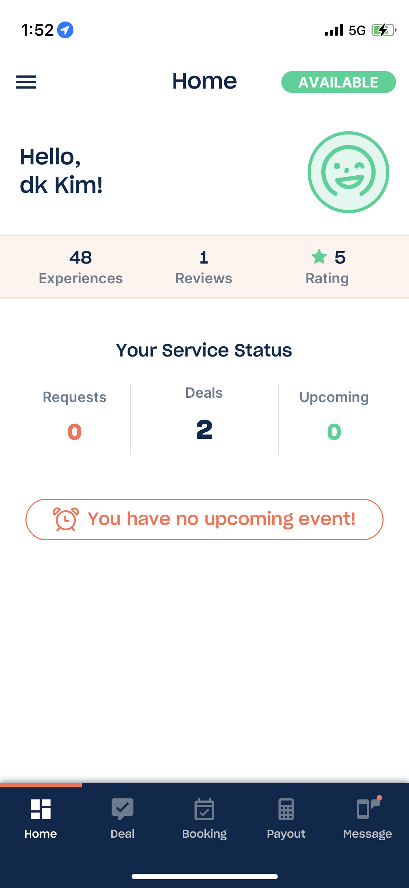
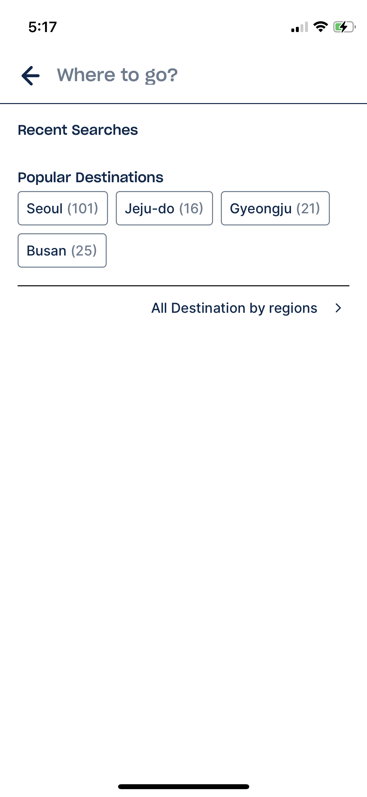
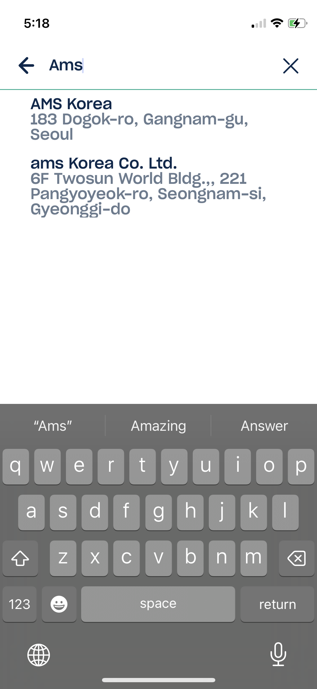
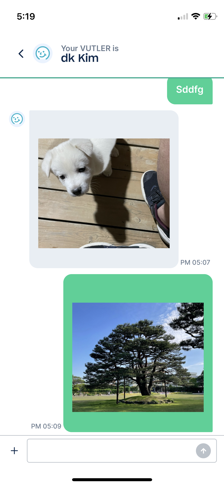
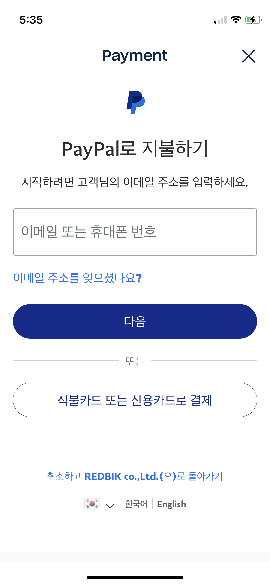
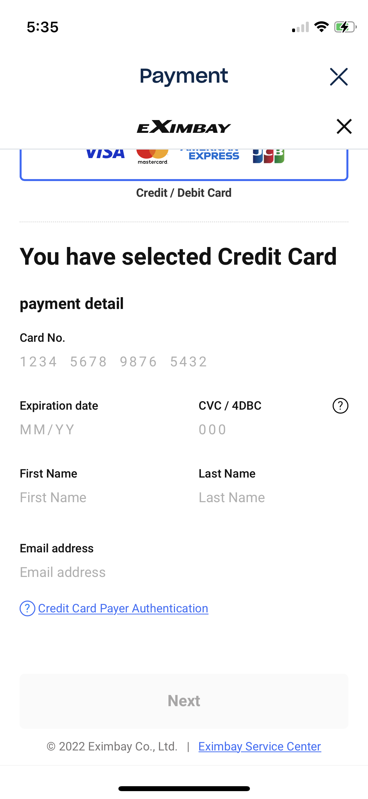
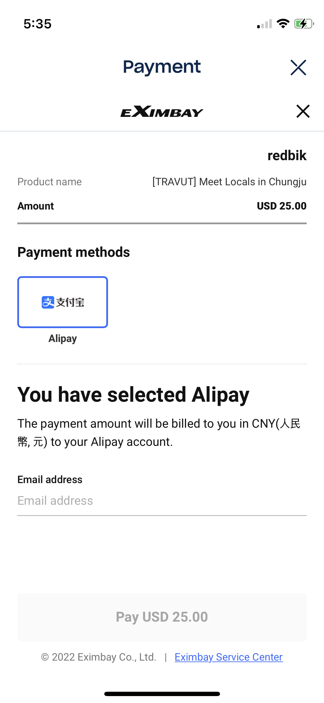
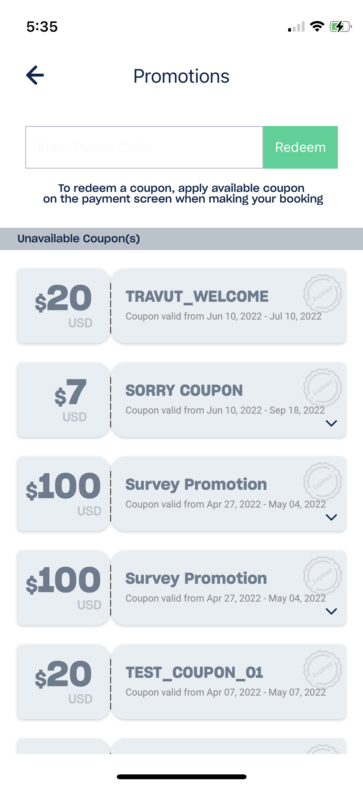

# TRAVUT  

[Travut ppt 링크](https://docs.google.com/presentation/d/19c48fWu7lhhnmsLZXPzPRRUia4t1vdar7DOyV1NPG-E/edit#slide=id.g215ea7d52b3_0_895)

### TRAVUT 소개 
Travut은 여행자와 가이드를 매칭하는 플랫폼 서비스입니다. 기존 여행사에서 제공하는 틀에 박힌 패키지 여행을 벗어나 여행자와 가이드가 직접 커뮤니케이션을 하도록 함으로써 가이드가 여행자가 원하는 맞춤서비스를 제공하는 것을 목적으로 두고 있습니다. 서비스 내에서 가이드는 집사(Vutler)로 지칭하여 믿음이 가는 서비스를 제공하는 것을 목표로 했습니다.  
[Traveler Playstore](https://play.google.com/store/apps/details?id=com.travutspottraveler)  
[Vuttler Playstore](https://play.google.com/store/apps/details?id=com.travutspotprovider)

### TRAVUT 기능 
TRAVUT은 여행자를 위한 앱과 가이드를 위한 앱 두앱으로 서비스 되고 있습니다.  
  

  
   

(좌) Traveler 앱 (우) Vutler(Guide) 앱  
  
서비스는 다음의 순서대로 진행됩니다.
1. 여행자의 Request 생성 - 여행자 앱에서 장소와 원하는 서비스의 종류를 선택한 후에 가이드 매칭을 시작할 수 있으며, 여행자의 요청과 가이드의 설정이 일치할 경우 가이드에게 알림이 가게 됩니다.
2. 가이드의 응답 - 알림을 받은 가이드는 여행자에게 서비스를 제공할지 여부를 선택할 수 있습니다. 얼마나 많은 가이드가 서비스를 제공할건지를 선택했냐에 따라 여행자와 가이드의 1대N의 매칭이 정해집니다.
3. 여행자와 가이드의 협상 - 여행자와 가이드들의 매칭이 성사되면 여행자와 가이드의 1대1 채팅방이 생성되는데, 여기서 여행자와 가이드가 어떤 서비스를 진행할 것인지를 채팅을 통해 정할 수 있습니다. 서비스가 정해지면, 가이드는 여행자에게 서비스의 명세를 보내게 되며, 여행자는 가이드의 명세를 확인한 후에 결제를 진행하게 됩니다. 여기서 여행자가 어떤 가이드와의 결제를 진행했냐에 따라 1대N이였던 가이드와의 관계에서 1대1로 변경됩니다.
4. 실제 서비스 받기 및 환불 - 가이드가 여행자에게 실제 서비스를 제공합니다. 여행자가 원할 경우 서비스가 진행되기 전에 환불을 받을 수 있습니다.
5. 서비스 평가 - 서비스 이후에 여행자는 가이드가 제공한 서비스의 만족도를 평가하여 게시할 수 있으며 이후에 다른 여행자가 해당 가이드를 선택할때 참고할 수 있습니다. 
6. 가이드 정산 - 가이드는 본인이 제공한 서비스의 금액을 주마다 정산받을 수 있습니다. 정산 방법은 Paypal 혹은 정해놓은 계좌로 금액을 받는 방법이 있으며, 정산 시기의 환율에 영향을 받습니다.

### TRAVUT 개발 개요
위에서 말했듯이 TRAVUT은 여행자를 위한 앱과 가이드를 위한 앱 두앱으로 서비스 되고 있습니다. 때문에 TRAVUT의 서비스는 두앱의 커뮤니케이션을 통해 서비스됩니다.  
TRAVUT은 React-native로 개발되었으며, Back-end는 AWS의 서비스를 통해 Serverless기반으로 개발되어있습니다.
1. Back-end  
앞서 말한 Serverless Back-end는 Graphql기반의 AWS Appsync를 통해 구현되어 있습니다. DB는 AWS Aurora(AWS RDS)와 DynamoDB(nosql)을 사용하고 있으며 Appsync에서 직접적으로 지원해주지 않는 기능들은 AWS Lambda로 구현되었습니다. Lambda를 통해 구현된 기능은 AWS Aurora의 쿼리를 생성하는 코드나 Push notification, Traveler side/Vutler(Guide) side Appsync간의 커뮤니케이션을 위한 코드 등이 있습니다.
2. Front-end  
React-native로 개발된 Front-end는 Apollo-client를 통해 Appsync와 연결되어 있습니다. 주로 Functional Component/hook으로 구현하였습니다. 그외의 기능들은 다음과 같습니다.  
(1) 로그인 기능  
AWS Cognito를 통해 로그인 기능이 구현되어 있습니다. 추가로 소셜로그인기능을 위해 firebase의 인증기능도 활용되고 있습니다.  
(2) Push notification 기능
Traveler앱과 Vutler(Guide)앱 간의 커뮤니케이션을 위해 Push notification 기능이 활용됩니다. 안드로이드와 IOS 모두의 Notification의 구현을 위해 Firebase Push notification(FCM)을 사용하고 있으며, AWS Aurora에서 계정정보와 함께 유저의 FCM Token정보가 관리되었습니다.  
(3) 위치기반 기능  
앱에 구현된 여러 위치 기반 서비스를 위해 Google Map API를 사용하였습니다. 이를 통해 구현된 기능은 Client의 위치 정보를 이용한 가까운 서비스 가능 지역 표시, 지역 검색, 채팅 내의 위치정보 전송등이 있습니다.  
(4) 채팅 기능
초기 채팅기능은 FCM의 Push notification의 수신에 따른 화면 갱신으로 구현되어 있습니다. 하지만 FCM만으로 구현하는 것은 한계가 있어, 추후 AWS Appsync의 Subscription 기능과 함께 구현하는 방법으로 변경되고, Front-end코드를 수정하여 성능이 개선되었습니다.  
(5) 결제 및 정산 기능
외국인의 앱 내의 결제의 구현을 위해 '아임포트' 서비스를 사용하여 Paypal, Eximbay를 통한 해외 신용카드 결제/알리페이 결제를 구현하였습니다.
Vutler(Guide)의 정산은 가이드의 Paypal계정에 전송하는 방법과 등록된 계좌에 수동전송하는 방법으로 구현되었습니다. Vutler(Guide)의 정산정보는 AWS Aurora RDS에서 관리되고 있습니다.
3. 기타  
Bitbucket을 통해 버전 관리를 하였으며, Playstore/Appstore업데이트에는 심사 기간을 거치기 때문에, 작은 규모의 업데이트나 급한 버그수정은 Microsoft의 Codepush를 사용하였습니다.

### 팀 내에서의 역할
3명의 개발자로 팀을 이루어, 초기 아이템 정의, 개발 스텍 정의, 개발로 시작하여 서비스의 유지관리및 업데이트까지 전반적인 개발에 참여하였습니다. 앱 내의 기능별로 역할을 나누어 개발을 하였으며 팀원 모두가 Back-end, Front-end개발에 함께 참여하였습니다. 앱 출시 이후에도 추가 기능이나 UI개선을 주기적으로 업데이트하는데 참여했습니다.

### 업무 내용
1. 아이템 설정  
2. 개발스택 정의
3. 서비스 개발
    - Push notification 기능 구현
        - Google Firebase Push Notification를 활용한 안드로이드/IOS Push notificatiion 구현
    - Google map API를 활용한 지역 기반 서비스 기능 구현
        - geolocation을 활용한 위치기반 서비스 구현
        - place search를 통한 지역 검색 기능 구현
        

            
             
        

        - 채팅 내의 지역 검색 및 위치 정보 전송 기능 구현
    - Traveler Request 및 Vutler(Guide) Response 기능 구현
        - Appsync, Lambda를 통해 Traveler의 request 생성 및 알림, Vutler(Guide)의 request에 대한 response 로직 구현
    - 앱 내 채팅기능 구현
        - Traveler와 Vutler(Guide) 간의 채팅 서비스 구현
        

             
        

    - Traveler 결제 기능 연동(Paypal/Eximbay)
        - Iamport의 서비스를 활용한 Paypal, Eximbay 결제 기능 연동
        

            
            
            
        

    - Vutler(Guide) 정산 기능 구현
        - Vutler(Guide)의 정산 방법 추가 (Paypal 계정 연동/계좌 등록) 기능 구현
        - Lambda를 통한 Vutler 정산 자동화 구현
        - Web view를 통한 Vutler(Guide) 정산정보 표시
    - Traveler 쿠폰 기능 구현
        - 쿠폰을 통한 서비스 할인 기능 구현  
        

             
        

    - 기타 React-native를 통한 화면 구현
4. 업데이트 및 유지관리
    - 정기적인 Playstore, Appstore 업데이트
    - Microsoft Codepush기능을 통한 업데이트

### 개발 스택
ReactJS, React-native, Javascript, GraphQL, Apollo Client, AWS Amplify, AWS Appsync, AWS DynamoDB, AWS Aurora, AWS Cognito, AWS Lambda, AWS S3, Firebase Authentication, Firebase Push notification, Bitbucket, Microsoft Codepush, Google maps API
***