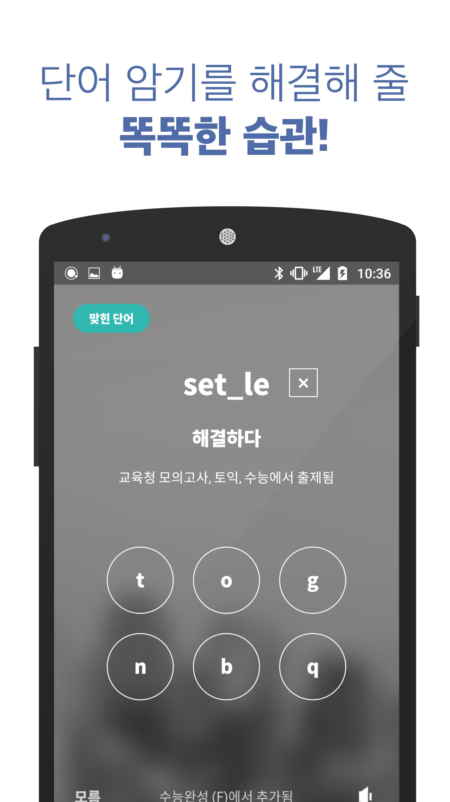
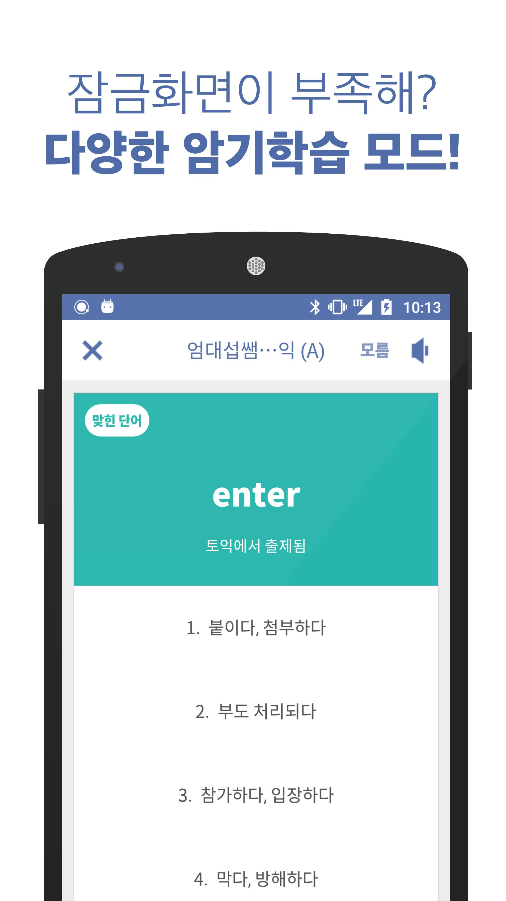

# 외움  

### 외움 소개
외움은 외국어 학습을 도와주는 서비스로, 잠금화면을 열때 마다 외국어문제를 노출시켜 서비스 사용자가 일상에서 쉽게 외국어 학습을 하도록 함에 목적을 두고 있었습니다.

### 외움 기능 
1. 잠금화면을 통한 외국어 학습 문제 노출
2. 유저의 문제 풀이 데이터를 활용하여 유저가 익히기 힘들어하는 외국어 문제를 더 자주 노출하도록 로직 구현
  

### 팀 내에서의 역할
외움 개발 초기(FindnLock)시절 안드로이드 개발자로 참여하였으며 창업멤버였습니다.
초기 개발 이후 개발에서 빠졌으나, 후에(2017.03 ~ 2017.09)  Back-end 개발자로 참여하여 유저의 앱 사용데이터 저장 및 활용에 대한 Back-end를 구현하였습니다.

### 업무 내용
1. 초기 아이템 설정  
2. 서비스 개발
    - Back-end 구현
        - Node.js를 활용한 Restful API 구현
        - Mongo를 통한 사용자 앱 사용 데이터 저장 및 활용
        - Firebase 실시간 데이터베이스를 활용하여 사용자의 현재 학습상황 및 스코어 정보 관리
### 참고 이미지

  
  
  
  
  
  
  
  

### 개발 스택
JavaScript, Node.js, AWS EC2, ExpressJS, MongoDB, Firebase
***